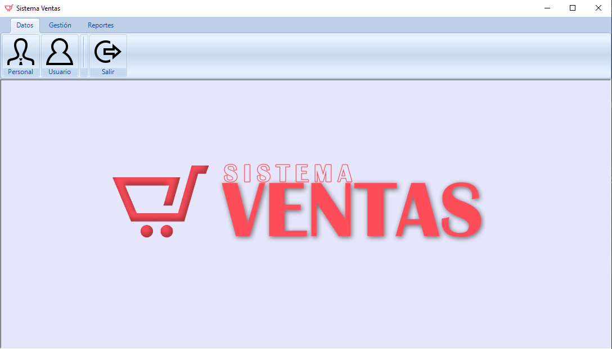
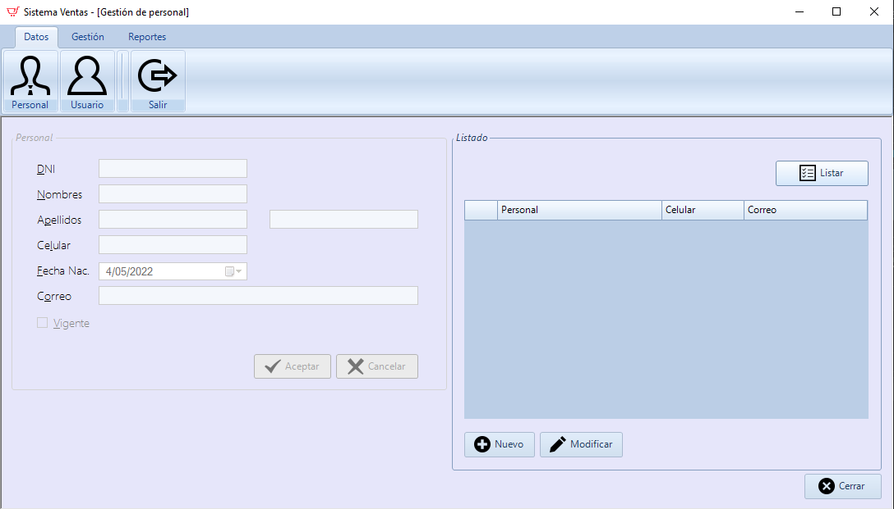

# Sistema de Ventas – CSharp GUI y SQLServer
Sistema Bancario en lenguaje CSharp y base de datos SQLServer, Proyecto del **sexto semestre** de estudios de Ingeniería Informática, presentado el **18/11/20**.

<strong>Imagen:</strong> GUI de Inicio de sesión.

## Uso
1. [**Datos**](#datos)
   - [**Personal**](#personal)
   - [**Usuario**](#usuario)
2. [**Gestión**](#gestión)
   - [**Empresa**](#empresa)
   - [**Local**](#local)
   - [**Precio local**](#precio-local)
   - [**Categoría**](#categoría)
   - [**Marca**](#marca)
   - [**Producto**](#producto)
3. [**Reportes**](#reportes)
   - [**Listado de productos**](#listado-de-productos)

## Datos

<strong>Imagen:</strong> Menú de datos.

### Personal
Gestión de datos de un trabajador o Personal de la empresa, con datos como: el número de DNI, nombres, apellido paterno, apellido materno, número de celular, la fecha de su nacimiento y su correo electrónico.

<strong>Imagen:</strong> Gestión de personal.

### Usuario
Gestión de datos de un Usuario, con datos como: el personal, nombre, la clave y el tipo de usuario.

<strong>Imagen:</strong> Gestión de usuario.

## Gestión

<strong>Imagen:</strong> Menú de gestión.

### Empresa
Gestión de una Empresa, con datos como: razón social, número de RUC, nombre de la página de facebook, nombre del canal de youtube, número de whatsapp, correo electrónico y su logo.

<strong>Imagen:</strong> Gestión de una empresa.

### Local
Gestión de un Local de una empresa, con datos como: la empresa, nombre, dirección y el número de teléfono.

<strong>Imagen:</strong> Gestión de un local.

### Precio local
Gestión del Precio de un local, con datos como: el local, el producto, el precio, un precio mínimo, su tipo ISC, el IGV, un monto exonerado y el stock.

<strong>Imagen:</strong> Gestión del precio de un local.

### Categoría
Gestión de una Categoría, con datos como: la empresa, el nombre y una descripción.

<strong>Imagen:</strong> Gestión de categoría.

### Marca
Gestión de una Marca, con datos como: el nombre y una descripción.

<strong>Imagen:</strong> Gestión de marca.

### Producto
Gestión de un Producto, con datos como: el nombre, la categoría, la marca, el tipo de producto y el tipo de control.

<strong>Imagen:</strong> Gestión de producto.

## Reportes

<strong>Imagen:</strong> Menú de reportes.

### Listado de productos 

<strong>Imagen:</strong> Listado de productos.

## Autores
- Farroñan R. Melyssa
- Garcia L. Alejandra
- Ramirez Benites Rafael
- [Rojas Vera Aarón](https://github.com/Aaron-Shrike)
- Rosales S. Juan
